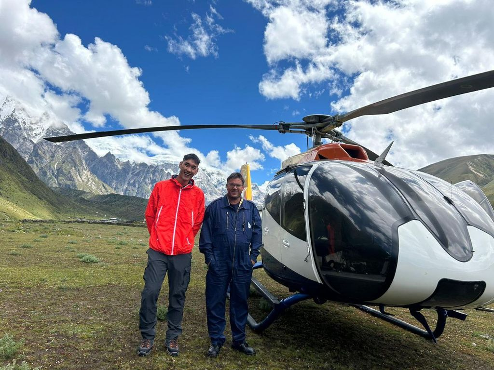

# About me

*Hello! I am Tshering Dorji.*

I am from a remote village called Ura, nestled in the heart of Bumthang—right in the central part of Bhutan. Growing up surrounded by serene mountains and cold fresh air, I traded that tranquillity for the fascinating chaos of circuits and signals, earning my degree in Electronics and Communication Engineering at the College of Science and Technology.

I'm a drone enthusiast - if it flies, buzzes, or can take stunning aerial shots, I am all in! you will also probably find me buried in a book. 
My reading palette? It is quite diverse: history, classical novels, psychological thrillers, science fiction, you name it! Throw in a few self-help books because, we are all works in progress.

## My background

**Qualification:** Bachelor’s in Electronics and Communication 
Engineering

**Graduated in:** 2023

**University:** Royal University of Bhutan.

**College:** College of Science and Technology (CST).

## Previous Work

### 1. Vitarana Drone (e-Yantra Robotics Competition 2019–2020)

Developed and programmed an autonomous drone capable of performing precision landings on designated aero markers, enabling accurate and efficient package delivery through autonomous navigation and landing algorithms.

🎥 **Project Demonstration:**  
https://youtu.be/9iwxHmlDowc

---

### 2. Strawberry Stacker (e-Yantra Robotics Competition 2021–2022)

Developed autonomous control algorithms for two drones that dynamically coordinated and collaborated to pick and place two different types of strawberry boxes into separate trucks. The system was implemented and tested in the Gazebo simulation environment, where the drones responded to objects appearing dynamically on the field.

🎥 **Project Demonstration:**  
https://youtu.be/68vKYh8ZXnU

---

### 3. Fab Academy Graduate

Completed the Fab Academy program, gaining hands-on experience in digital fabrication, electronics design, embedded systems, computer-aided design (CAD), and rapid prototyping through intensive project-based learning.

🌐 **Fab Academy Journey & Documentation:**  
https://fabacademy.org/2025/labs/bhutan/students/tshering-dorji/

---

### 4. Research Publication

**Public Warning and Evacuation Experiences During Recent GLOF Events (2019 and 2023) and Recommendations for Future Preparedness: Insights from Lunana, Bhutan**

Co-authored a research paper exploring community experiences during recent Glacial Lake Outburst Flood (GLOF) events and providing recommendations for improving early warning systems and evacuation preparedness in Lunana, Bhutan.

📄 **Published Paper:**  
https://www.sciencedirect.com/science/article/pii/S2212420926002232